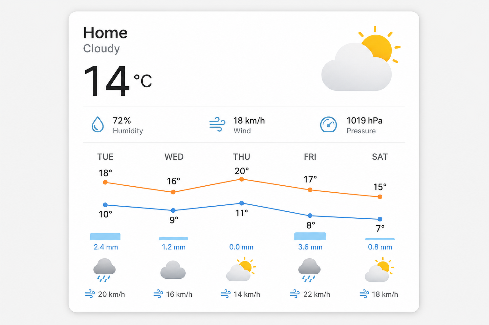

# Veðurkort Weather Card

Home Assistant Lovelace weather card with **[Meteocons](https://meteocons.com/)** icons, optional CSS weather backgrounds, and Chart.js daily/hourly forecasts.

**Custom type:** `custom:vedurkort-weather-card`



## Features

- One card, three layouts: `basic`, `daily`, `hourly`
- **Meteocons only** — styles `fill` / `flat` / `line` / `monochrome`, animated or static (8 combinations)
- Day/night condition icons where Meteocons provides variants
- Optional CSS animated backgrounds (cloud opacity lightly follows `cloud_coverage`)
- Optional details: sun, humidity, wind (Beaufort icon + system unit), UV, pressure, cloud coverage, feels like, dew point, visibility
- Optional sensor overrides with entity pickers in the UI editor
- Separate `daily` and `hourly` config blocks

## Installation

### HACS

1. Add this repository as a **custom repository** (category: Lovelace / Dashboard)
2. Install **Veðurkort Weather Card**
3. Add the resource if needed: `/hacsfiles/vedurkort-weather-card/vedurkort-weather-card.js` (type: JavaScript Module)
4. Refresh Lovelace cache / restart Home Assistant if the card does not appear

### Manual

Copy `dist/vedurkort-weather-card.js` to your HA `www/` folder and add a Lovelace resource pointing to `/local/vedurkort-weather-card.js` (JavaScript Module).

## Configuration variables

### Card options

| Name | Type | Default | Description |
| --- | --- | --- | --- |
| `type` | string | **Required** | Must be `custom:vedurkort-weather-card`. |
| `entity` | string | **Required** | A `weather.*` entity. |
| `layout` | string | `basic` | Card layout: `basic`, `daily`, or `hourly`. |
| `name` | string | none | Override the location/title. Falls back to the entity friendly name. |
| `icon_style` | string | `fill` | Meteocons style: `fill`, `flat`, `line`, or `monochrome`. |
| `animated_icons` | boolean | `true` | Use animated Meteocons (`true`) or static SVGs (`false`). |
| `animated_background` | boolean | `false` | Enable CSS weather background by condition. Cloud layer opacity is lightly scaled from `cloud_coverage` when available. |
| `show_sun` | boolean | `false` | Show sunrise and sunset times. |
| `show_humidity` | boolean | `false` | Show humidity. |
| `show_wind_speed` | boolean | `false` | Show wind speed with Beaufort icon; value stays in system/entity unit. |
| `show_wind_direction` | boolean | `false` | Show wind direction (compass label + Meteocons wind-direction icon). |
| `show_uv_index` | boolean | `false` | Show UV index. |
| `show_pressure` | boolean | `false` | Show pressure. |
| `show_cloud_coverage` | boolean | `false` | Show cloud coverage (%). |
| `show_feels_like` | boolean | `false` | Show feels-like / apparent temperature. |
| `show_dew_point` | boolean | `false` | Show dew point. |
| `show_visibility` | boolean | `false` | Show visibility. |
| `sun_entity` | string | `sun.sun` | Entity used for sunrise/sunset and day/night icon picking. |
| `temperature_entity` | string | none | Optional sensor override for current temperature. |
| `humidity_entity` | string | none | Optional sensor override for humidity. |
| `wind_speed_entity` | string | none | Optional sensor override for wind speed. |
| `wind_bearing_entity` | string | none | Optional sensor override for wind bearing (degrees). |
| `uv_index_entity` | string | none | Optional sensor override for UV index. |
| `pressure_entity` | string | none | Optional sensor override for pressure. |
| `cloud_coverage_entity` | string | none | Optional sensor override for cloud coverage. |
| `feels_like_entity` | string | none | Optional sensor override for feels-like temperature. |
| `dew_point_entity` | string | none | Optional sensor override for dew point. |
| `visibility_entity` | string | none | Optional sensor override for visibility. |
| `daily` | object | see below | Daily forecast options. Used when `layout: daily`. |
| `hourly` | object | see below | Hourly forecast options. Used when `layout: hourly`. |

### Daily options (`daily`)

| Name | Type | Default | Description |
| --- | --- | --- | --- |
| `days` | number | `5` | Number of daily forecast points to show. |
| `show_condition_icons` | boolean | `true` | Show Meteocons condition icons under the chart. |
| `show_wind` | boolean | `true` | Show Beaufort + direction icons and speed under the chart. |
| `precip_type` | string | `rainfall` | Precipitation series: `rainfall` or `probability`. |

### Hourly options (`hourly`)

| Name | Type | Default | Description |
| --- | --- | --- | --- |
| `hours` | number | `12` | Number of hourly forecast points to show. |
| `show_condition_icons` | boolean | `true` | Show Meteocons condition icons under the chart. |
| `show_wind` | boolean | `true` | Show Beaufort + direction icons and speed under the chart. |
| `precip_type` | string | `rainfall` | Precipitation series: `rainfall` or `probability`. |

`daily` and `hourly` are separate objects so each layout can be tuned independently, even though only one `layout` is visible at a time.

## Example usage

### Basic card

```yaml
type: custom:vedurkort-weather-card
entity: weather.forecast_thuis
layout: basic
icon_style: fill
animated_icons: true
animated_background: true
show_sun: true
show_humidity: true
show_wind_speed: true
show_wind_direction: true
show_uv_index: true
show_pressure: true
show_cloud_coverage: true
```

### Daily forecast

```yaml
type: custom:vedurkort-weather-card
entity: weather.forecast_thuis
layout: daily
daily:
  days: 7
  show_condition_icons: true
  show_wind: true
  precip_type: rainfall
```

### Hourly forecast

```yaml
type: custom:vedurkort-weather-card
entity: weather.forecast_thuis
layout: hourly
hourly:
  hours: 12
  precip_type: probability
```

### Weather integrations & missing attributes

Not every weather integration exposes every attribute. Veðurkort reads values from the `weather.*` entity when present, and otherwise from optional override sensors.

| Attribute | Typical weather attr | Notes |
| --- | --- | --- |
| Temperature | `temperature` | Usually available |
| Humidity | `humidity` | Usually available |
| Wind speed / bearing | `wind_speed`, `wind_bearing` | Usually available |
| Pressure | `pressure` | Often available |
| Cloud coverage | `cloud_coverage` | Often available |
| UV index | `uv_index` | Integration-dependent |
| Feels like | `apparent_temperature` | Missing on some (e.g. Meteorologisk institutt) |
| Dew point | `dew_point` | Integration-dependent |
| Visibility | `visibility` | Missing on some (e.g. Meteorologisk institutt) |
| Sunrise / sunset | via `sun.sun` | Not from the weather entity |

On the card, detail chips are **hidden when there is no value**. In the visual editor, toggles stay available and show a small hint whether the selected weather entity currently has that attribute — use an override sensor when it does not.

### With sensor overrides

```yaml
type: custom:vedurkort-weather-card
entity: weather.forecast_thuis
layout: basic
temperature_entity: sensor.outdoor_temperature
humidity_entity: sensor.outdoor_humidity
uv_index_entity: sensor.uv_index
pressure_entity: sensor.pressure
```

## Credits & inspiration

| Project | Role |
| --- | --- |
| **[Meteocons](https://meteocons.com/)** by [Bas Milius](https://github.com/basmilius/meteocons) | **All weather icons** — animated (`@meteocons/svg`) and static (`@meteocons/svg-static`) SVGs in fill / flat / line / monochrome. Only a curated subset for [HA weather conditions](https://www.home-assistant.io/integrations/weather/#condition-mapping) (plus sun, humidity, UV, barometer, Beaufort, wind-direction) is bundled. Homepage demos also inspired the basic layout. MIT licensed. |
| [weather-chart-card](https://github.com/mlamberts78/weather-chart-card) by Marc Lamberts | Forecast UX: Chart.js temperature lines, precipitation bars, condition/wind forecast row. No longer maintained; this card reimplements similar patterns in TypeScript. |
| [HA-Animated-cards](https://github.com/Anashost/HA-Animated-cards) (climate / weather examples) | Inspiration for optional CSS/HTML weather backgrounds by condition. |

## Development

```bash
npm install
npm run build
```

`npm run sync-icons` copies the curated Meteocons subset into `src/assets/meteocons/` (also runs automatically during `npm run build`).

## License

MIT — see [LICENSE](LICENSE).

Meteocons icons are MIT licensed — copyright © Bas Milius. See [NOTICE](NOTICE), [meteocons.com](https://meteocons.com/), and the [Meteocons LICENSE](https://github.com/basmilius/meteocons/blob/main/LICENSE).
