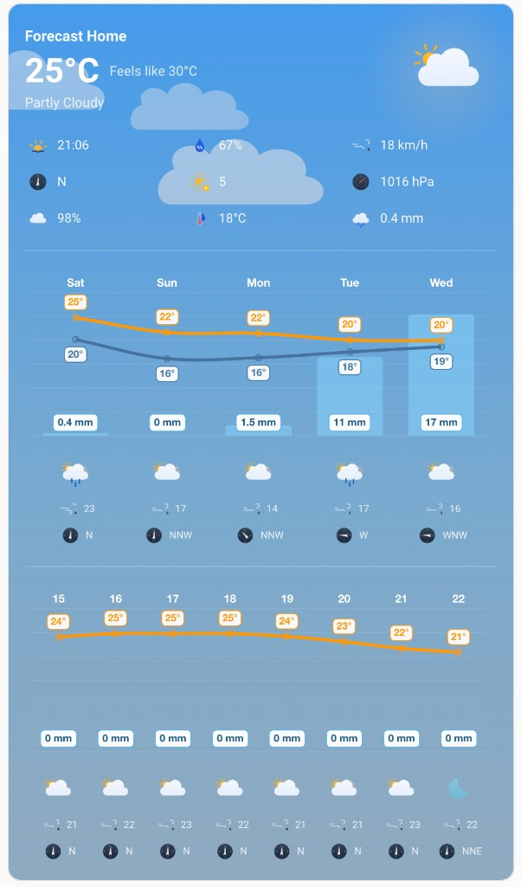
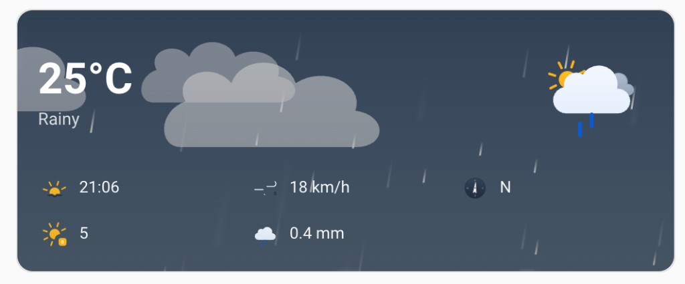
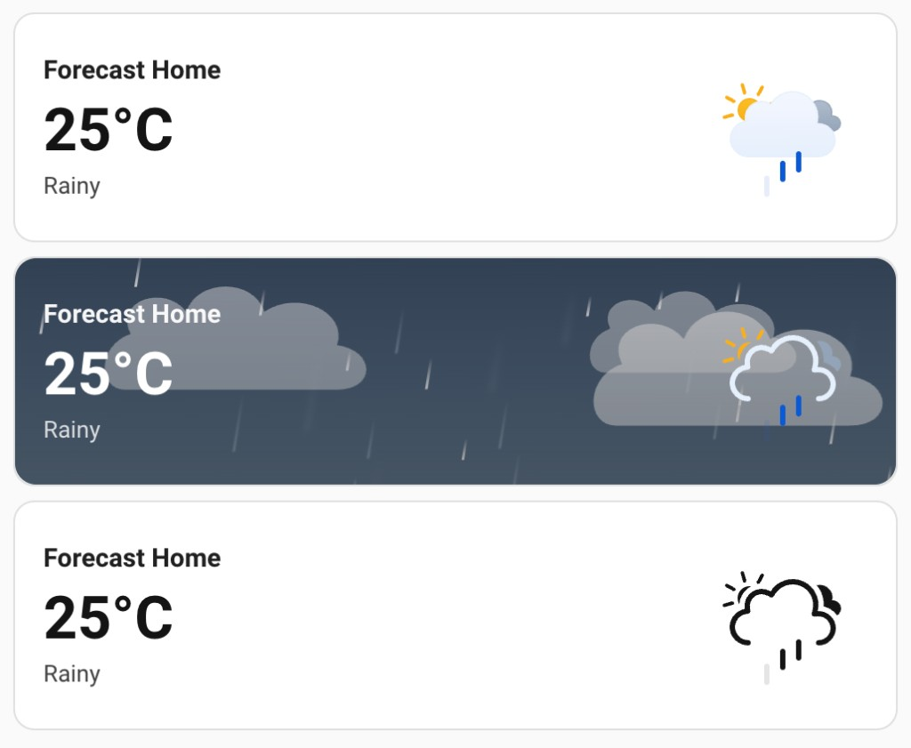
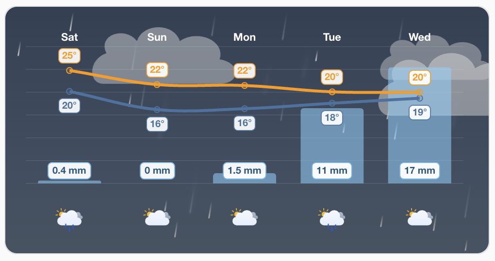
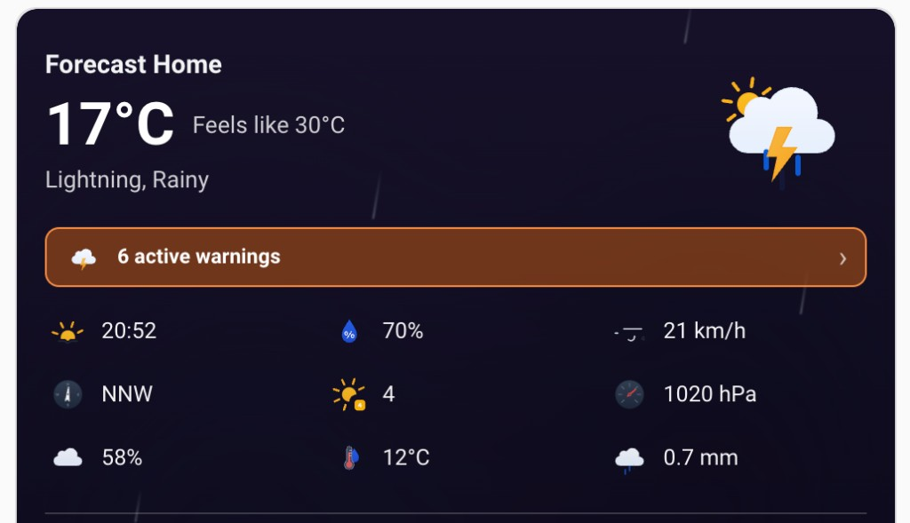
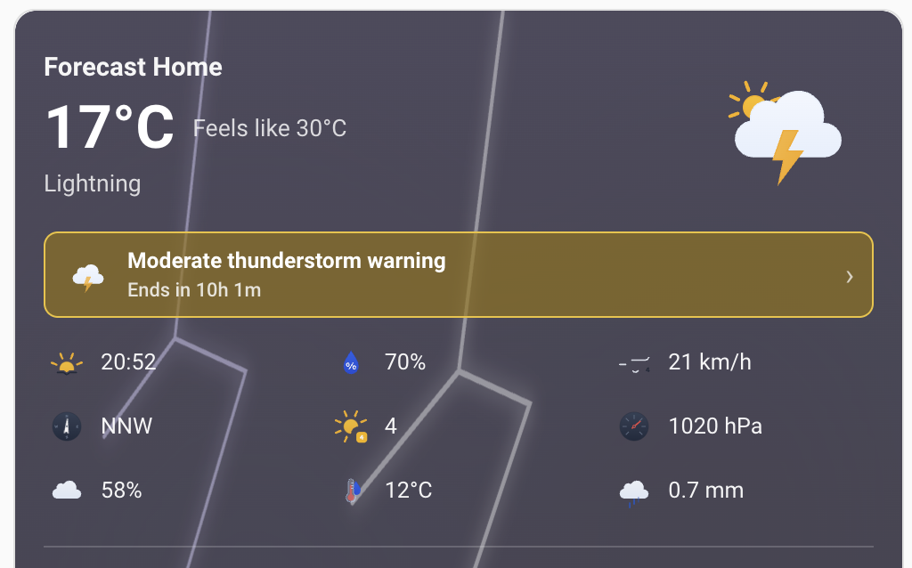
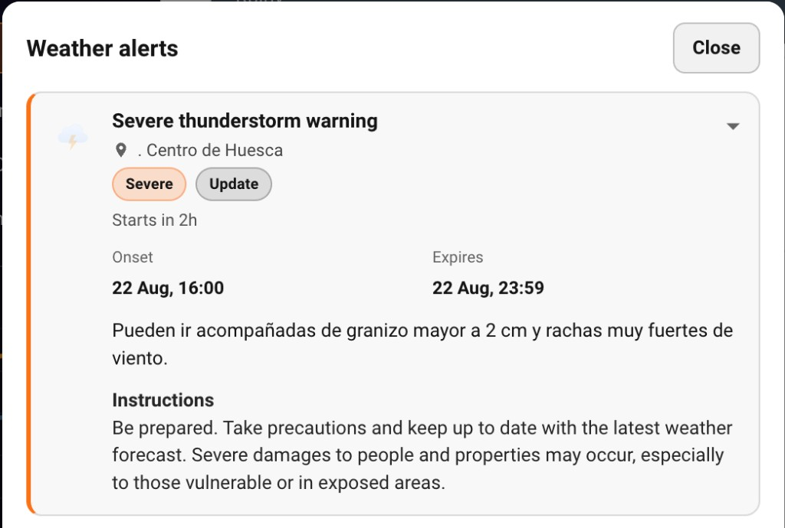

# Veðurkort Weather Card

[](https://hacs.xyz/)
[](https://www.home-assistant.io/)
[](LICENSE)
[](https://www.typescriptlang.org/)

**Veðurkort** is Icelandic for “weather card” / “weather map”. Pronounced roughly *VEH-thur-kort* (ð like the *th* in *weather*).

Home Assistant Lovelace weather card with **[Meteocons](https://meteocons.com/)** icons, optional CSS weather backgrounds, and Chart.js daily/hourly forecasts.

**Custom type:** `custom:vedurkort-weather-card`

| Full | Current | Icon styles | Daily only |
| --- | --- | --- | --- |
|  |  |  |  |

## Features

- Compose sections independently: current weather, daily forecast, hourly forecast (any combination)
- **Meteocons only** — styles `fill` / `flat` / `line` / `monochrome`, animated or static (8 combinations)
- Day/night condition icons (hourly icons follow sun rising/setting; daily uses daytime variants where available). Cloudy / precip / storm icons also follow `cloud_coverage` (sunless when ≥65% or unavailable)
- Optional CSS animated backgrounds (cloud opacity lightly follows `cloud_coverage`)
- Optional current-weather details: next sunrise/sunset, humidity, wind speed, direction & gust (separate chips; Beaufort icon for speed/gust), UV, pressure, cloud coverage, dew point, visibility (2–3 column grid by card width)
- Layout presets: `default`, `compact`, or `minimal` density
- Tap / hold / double-tap Lovelace actions on the current-weather block (defaults to a detail sheet; use `tap_action: { action: more-info }` for the HA entity dialog)
- Tap any detail chip to open a metric detail sheet with forecast chart, interpretation, and related stats
- Hourly chart horizontal scroll when showing more than 12 hours
- Localized UI (see [Localization](#localization))
- Feels-like temperature shown beside the main temperature when enabled
- Subtle section dividers when more than one section is shown
- CSS tooltips on detail and forecast icons (shadow-DOM friendly)
- Full visual editor — configure everything in the UI, no YAML required
- Empty-card hint when no sections are enabled
- Optional sensor overrides with entity pickers in the UI editor
- Separate `daily` and `hourly` config blocks
- Optional **weather alerts** — summary strip below current weather (via [CAP Alerts](https://github.com/seevee/cap_alerts) or core MeteoAlarm); tap to open a detail dialog

## Localization

The card uses your Home Assistant language (`Settings → System → General → Language`), via `hass.locale.language` with fallbacks to `hass.language` and `hass.config.language`.

**Supported UI languages:**

| Code | Language |
| --- | --- |
| `nl` | Dutch |
| `en` | English |
| `is` | Icelandic |

Regional variants (e.g. `nl-BE`, `en-GB`) map to the base code above when it is supported.

**Fallback:** If your language is not supported, the card uses **English**. The same English fallback applies to any individual string that is missing from a supported locale.

Not translated by the card: weather condition names (from Home Assistant entity states), alert event/headline text from CAP or MeteoAlarm, and raw API error messages from forecast services.

## Requirements

- **Home Assistant 2023.9+** for live daily/hourly forecasts (`weather/subscribe_forecast`). Older cores may still work via the `weather.get_forecasts` service fallback when subscribe is unavailable.
- The config editor probes forecasts via subscribe and, as a last resort, legacy `attributes.forecast` on the weather entity (no service calls, to avoid HA error toasts).

## Installation

### HACS

1. Add this repository as a **custom repository** (category: Lovelace / Dashboard)
2. Install **Veðurkort Weather Card**
3. Add the resource if needed: `/hacsfiles/vedurkort-weather-card/vedurkort-weather-card.js` (type: JavaScript Module)
4. Refresh Lovelace cache / restart Home Assistant if the card does not appear

### Manual

Copy `dist/vedurkort-weather-card.js` to your HA `www/` folder and add a Lovelace resource pointing to `/local/vedurkort-weather-card.js` (JavaScript Module).

## Configuration variables

### Card options

| Name | Type | Default | Description |
| --- | --- | --- | --- |
| `type` | string | **Required** | Must be `custom:vedurkort-weather-card`. |
| `entity` | string | **Required** | A `weather.*` entity. |
| `name` | string | none | Override the location/title. Falls back to the entity friendly name. |
| `show_name` | boolean | `true` | Show the location/title header at the top of the card. |
| `layout` | string | `default` | Visual density: `default`, `compact` (smaller hero), or `minimal` (smaller temp + icon; denser detail chips). |
| `icon_style` | string | `fill` | Meteocons style: `fill`, `flat`, `line`, or `monochrome`. |
| `animated_icons` | boolean | `true` | Use animated Meteocons (`true`) or static SVGs (`false`). |
| `animated_background` | boolean | `false` | Enable CSS weather background by condition. Cloud layer opacity is lightly scaled from `cloud_coverage` when available. |
| `show_current` | boolean | `true` | Show the current weather section (condition, temperature, icon). Detail chips only appear when this is on. |
| `show_sun` | boolean | `false` | Show the next sunrise or sunset (sunset while the sun is up, sunrise while down). |
| `show_humidity` | boolean | `false` | Show humidity. |
| `show_wind_speed` | boolean | `false` | Show wind speed with Beaufort icon; value stays in system/entity unit. |
| `show_wind_direction` | boolean | `false` | Show wind direction (compass label + Meteocons wind-direction icon). |
| `show_wind_gust` | boolean | `false` | Show wind gust with Beaufort icon. |
| `show_uv_index` | boolean | `false` | Show UV index. |
| `show_pressure` | boolean | `false` | Show pressure. |
| `show_cloud_coverage` | boolean | `false` | Show cloud coverage (%). |
| `show_feels_like` | boolean | `false` | Show feels-like / apparent temperature beside the main temperature. |
| `show_dew_point` | boolean | `false` | Show dew point. |
| `show_visibility` | boolean | `false` | Show visibility. |
| `show_precipitation` | boolean | `false` | Show current precipitation amount. |
| `show_precipitation_probability` | boolean | `false` | Show current precipitation probability (%). |
| `daily` | object | see below | Daily forecast section options. |
| `hourly` | object | see below | Hourly forecast section options. |
| `show_alerts` | boolean | `false` | Show a weather-alert summary when an alert source is configured and at least one **active** warning exists. Hidden when idle. Requires `show_current: true` for strip placement on the current-weather section. |
| `alerts_device` | string | none | [CAP Alerts](https://github.com/seevee/cap_alerts) **device id** — discovers all per-alert sensors under that device. Recommended for CAP Alerts usage. Auto-detected when you have exactly one CAP device. |
| `alerts_entities` | list | none | One or more alert entities (e.g. `binary_sensor.meteoalarm`). Active warnings from all entities are merged. |
| `tap_action` | object | detail | Lovelace action on tap of the current-weather block. Default opens the current-conditions detail sheet. Use `{ action: more-info }` for Home Assistant’s entity dialog. |
| `hold_action` | object | none | Lovelace action on hold. |
| `double_tap_action` | object | none | Lovelace action on double-tap. |
| `condition_entity` | string | none | Optional override for the **current** condition (background scene, main icon, condition label). Forecast sections still use `entity`. Handy for testing scenes via an `input_select` of HA condition strings. |
| `temperature_entity` | string | none | Optional sensor override for current temperature. |
| `humidity_entity` | string | none | Optional sensor override for humidity. |
| `wind_speed_entity` | string | none | Optional sensor override for wind speed. |
| `wind_bearing_entity` | string | none | Optional sensor override for wind bearing (degrees). |
| `wind_gust_entity` | string | none | Optional sensor override for wind gust. |
| `uv_index_entity` | string | none | Optional sensor override for UV index. |
| `pressure_entity` | string | none | Optional sensor override for pressure. |
| `cloud_coverage_entity` | string | none | Optional sensor override for cloud coverage. |
| `feels_like_entity` | string | none | Optional sensor override for feels-like temperature. |
| `dew_point_entity` | string | none | Optional sensor override for dew point. |
| `visibility_entity` | string | none | Optional sensor override for visibility. |
| `precipitation_entity` | string | none | Optional sensor override for precipitation amount. |
| `precipitation_probability_entity` | string | none | Optional sensor override for precipitation probability. |
| `sun_entity` | string | `sun.sun` | Entity used for sunrise/sunset times and hourly day/night icon picking. |

### Daily options (`daily`)

| Name | Type | Default | Description |
| --- | --- | --- | --- |
| `enabled` | boolean | `false` | Show the daily forecast chart and icons. |
| `days` | number | `5` | Number of daily forecast points to show (2–7). |
| `show_condition_icons` | boolean | `true` | Show Meteocons condition icons under the chart. |
| `show_wind_speed` | boolean | `true` | Show Beaufort icon + speed under the chart. |
| `show_wind_direction` | boolean | `true` | Show compass label + wind-direction icon under the chart. |
| `precip_type` | string | `rainfall` | Precipitation series: `rainfall` or `probability`. |

### Hourly options (`hourly`)

| Name | Type | Default | Description |
| --- | --- | --- | --- |
| `enabled` | boolean | `false` | Show the hourly forecast chart and icons. |
| `hours` | number | `12` | Number of hourly forecast points to show (2–48). |
| `show_condition_icons` | boolean | `true` | Show Meteocons condition icons under the chart. |
| `show_wind_speed` | boolean | `true` | Show Beaufort icon + speed under the chart. |
| `show_wind_direction` | boolean | `true` | Show compass label + wind-direction icon under the chart. |
| `precip_type` | string | `rainfall` | Precipitation series: `rainfall` or `probability`. |

Enable any combination of `show_current`, `daily.enabled`, and `hourly.enabled`. When both forecasts are on, daily is shown above hourly. If all three are off, the card shows a short configuration hint.

## Detail sheets

Tap the **current-weather block** (temperature + condition) or any **detail chip** to open a centered detail sheet. When `animated_background` is enabled, the sheet reuses the same CSS weather scene as the card.

Each sheet shows a large hero value, a short interpretation line, optional **24-hour forecast chart** (from hourly forecast data), and related stats. Charts are available for temperature, humidity, wind speed, precipitation, precipitation probability, and cloud coverage. UV, pressure, visibility, dew point, and gust show current values and copy without a chart when hourly forecast lacks that field.

**Tap action default:** opens the current-conditions sheet. Restore Home Assistant’s entity dialog with:

```yaml
tap_action:
  action: more-info
```

Hourly forecast is subscribed automatically when `show_current` is on (even if the hourly forecast section is disabled), so chip charts have data on first tap.

## Weather alerts

Veðurkort can show official weather warnings alongside current conditions. The card **does not fetch alerts itself** — it reads Home Assistant entities from an alerts integration you install separately.

### How it works

1. **Enable** `show_alerts` in the visual editor (or YAML).
2. **Connect** a CAP Alerts device or a MeteoAlarm binary sensor (see [Setup](#weather-alerts-setup) below).
3. When at least one **active** warning exists, a tappable strip appears **below the temperature/condition block** and above the detail chips — current weather stays the hero.
4. **Tap** the strip to open a dialog listing all active warnings. Each row expands in place for description, instructions, onset/expires, and location.

| Multiple warnings | Single warning | Detail dialog |
| --- | --- | --- |
|  |  |  |

**Strip labels**

- **One alert:** event title + relative timing.
- **Several alerts:** lead warning title + relative timing and overflow.

**What counts as “active”**

- Yellow, orange, and red MeteoAlarm / CAP warnings are shown.
- **Green (level 1)** is filtered out — in Europe that means “no particular awareness needed”, not a real warning.
- Cancelled / expired CAP phases are hidden.

When a **red / extreme** warning is **currently active**, the card switches to the exceptional animated background and shows the Meteocons extreme variant of the current weather condition icon. Yellow and orange alerts, and red alerts before their onset time, do not change the scene or main icon.

### What you need

| Source | Best for | Install |
| --- | --- | --- |
| **[CAP Alerts](https://github.com/seevee/cap_alerts)** (recommended) | Multiple concurrent alerts across **EU/Europe**, North America, and other regions | HACS custom integration |
| **[MeteoAlarm](https://www.home-assistant.io/integrations/meteoalarm/)** (built-in) | Simple **EU/Europe** setup when you only need **one alert at a time** | Settings → Integrations |

CAP Alerts creates one Home Assistant sensor per active alert under a device. Point Veðurkort at that **device** (`alerts_device`) so all current warnings are picked up automatically.

The card never calls alert APIs directly — only Home Assistant entity state (and the device registry for CAP discovery).

## Weather alerts setup

Alerts are optional and **off by default** (`show_alerts: false`). Existing cards are unchanged until you enable them.

### Visual editor

1. Open the card editor → **Weather alerts** section.
2. Turn on **Show weather alerts**.
3. Choose **Alert source**:
   - **CAP Alerts device** — pick the device created by [CAP Alerts](https://github.com/seevee/cap_alerts) (or leave blank if exactly one CAP device exists; the card auto-detects it).
   - **Alert entities** — pick one or more MeteoAlarm or CAP binary/sensor entities.

**Important:** Do **not** select dozens of individual CAP “Minor … warning” sensors in entity mode. CAP Alerts creates one sensor per active alert under a device — point the card at the **device**, not each sensor.

### CAP Alerts YAML example (Europe / multi-alert)

Install CAP Alerts with the MeteoAlarm provider for your country/region, then:

```yaml
type: custom:vedurkort-weather-card
entity: weather.home
show_current: true
show_alerts: true
alerts_device: REPLACE_WITH_CAP_DEVICE_ID
```

Find the device id in **Settings → Devices → CAP Alerts** (or let the editor list it).

### Europe MeteoAlarm YAML example

```yaml
type: custom:vedurkort-weather-card
entity: weather.home
show_current: true
show_alerts: true
alerts_entities:
  - binary_sensor.meteoalarm
```

### Alerts-only card

If current weather is hidden but alerts are enabled, the strip still renders in its own section:

```yaml
type: custom:vedurkort-weather-card
entity: weather.home
show_current: false
show_alerts: true
alerts_device: REPLACE_WITH_CAP_DEVICE_ID
```

## Example usage

### Current weather only

```yaml
type: custom:vedurkort-weather-card
entity: weather.forecast_thuis
show_current: true
icon_style: fill
animated_icons: true
animated_background: true
show_sun: true
show_humidity: true
show_wind_speed: true
show_wind_direction: true
show_uv_index: true
show_pressure: true
show_cloud_coverage: true
```

### With weather alerts (CAP Alerts device)

```yaml
type: custom:vedurkort-weather-card
entity: weather.forecast_thuis
show_current: true
show_alerts: true
alerts_device: REPLACE_WITH_CAP_DEVICE_ID
```

### With weather alerts (Europe MeteoAlarm binary sensor)

```yaml
type: custom:vedurkort-weather-card
entity: weather.forecast_thuis
show_current: true
show_alerts: true
alerts_entities:
  - binary_sensor.meteoalarm
```

### Test backgrounds without changing your weather entity

Create an `input_select` whose options are HA condition strings (`sunny`, `rainy`, `pouring`, `hail`, …), then:

```yaml
type: custom:vedurkort-weather-card
entity: weather.forecast_thuis
animated_background: true
condition_entity: input_select.weather_scene_test
```

### Current + daily forecast

```yaml
type: custom:vedurkort-weather-card
entity: weather.forecast_thuis
show_current: true
daily:
  enabled: true
  days: 7
  show_condition_icons: true
  show_wind_speed: true
  show_wind_direction: true
  precip_type: rainfall
```

### Daily forecast only

```yaml
type: custom:vedurkort-weather-card
entity: weather.forecast_thuis
show_current: false
daily:
  enabled: true
  days: 5
```

### Current + daily + hourly

```yaml
type: custom:vedurkort-weather-card
entity: weather.forecast_thuis
show_current: true
daily:
  enabled: true
  days: 5
hourly:
  enabled: true
  hours: 12
  precip_type: probability
```

### Weather integrations & missing attributes

Not every weather integration exposes every attribute. Veðurkort reads values from the `weather.*` entity when present, and otherwise from optional override sensors.

| Attribute | Typical weather attr | Notes |
| --- | --- | --- |
| Temperature | `temperature` | Usually available |
| Humidity | `humidity` | Usually available |
| Wind speed / bearing | `wind_speed`, `wind_bearing` | Usually available |
| Pressure | `pressure` | Often available |
| Cloud coverage | `cloud_coverage` | Often available |
| UV index | `uv_index` | Integration-dependent |
| Feels like | `apparent_temperature` | Missing on some (e.g. Meteorologisk institutt) |
| Dew point | `dew_point` | Integration-dependent |
| Visibility | `visibility` | Missing on some (e.g. Meteorologisk institutt) |
| Sunrise / sunset | via `sun.sun` | Not from the weather entity |

On the card, detail chips are **hidden when there is no value**. In the visual editor, toggles stay available and show a small hint whether the selected weather entity currently has that attribute — use an override sensor when it does not.

### With sensor overrides

```yaml
type: custom:vedurkort-weather-card
entity: weather.forecast_thuis
show_current: true
temperature_entity: sensor.outdoor_temperature
humidity_entity: sensor.outdoor_humidity
uv_index_entity: sensor.uv_index
pressure_entity: sensor.pressure
```

## Credits & inspiration

| Project | Role |
| --- | --- |
| [weather_alerts_card](https://github.com/seevee/weather_alerts_card) by seevee | Inspiration for CAP/MeteoAlarm adapter patterns and alert UX (relative timing, awareness levels). Veðurkort keeps alerts as an optional strip + dialog inside this weather card rather than a dedicated alerts dashboard. |
| **[Meteocons](https://meteocons.com/)** by [Bas Milius](https://github.com/basmilius/meteocons) | **All weather icons** — animated (`@meteocons/svg`) and static (`@meteocons/svg-static`) SVGs in fill / flat / line / monochrome. Only a curated subset for [HA weather conditions](https://www.home-assistant.io/integrations/weather/#condition-mapping) (plus sun, humidity, UV, barometer, Beaufort, wind-direction, alert severity codes) is bundled. Homepage demos also inspired the current-weather presentation. MIT licensed. |
| [weather-chart-card](https://github.com/mlamberts78/weather-chart-card) by Marc Lamberts | Forecast UX: Chart.js temperature lines, precipitation bars, condition/wind forecast row. No longer maintained; this card reimplements similar patterns in TypeScript. |
| [HA-Animated-cards](https://github.com/Anashost/HA-Animated-cards) (climate / weather examples) | Inspiration for optional CSS/HTML weather backgrounds by condition. |
| [GlassHome weather scenes](https://github.com/glasshome/widgets/tree/main/src/weather/background/scenes) | Inspiration for animated background techniques — depth-layered rain, hail bounce, storm bolts, wind streaks, and richer night-sky treatment. |

## Development

```bash
npm install
npm run build
```

`npm run sync-icons` copies the curated Meteocons subset into `src/assets/meteocons/` (also runs automatically during `npm run build`).

## License

MIT — see [LICENSE](LICENSE).

Meteocons icons are MIT licensed — copyright © Bas Milius. See [NOTICE](NOTICE), [meteocons.com](https://meteocons.com/), and the [Meteocons LICENSE](https://github.com/basmilius/meteocons/blob/main/LICENSE).
